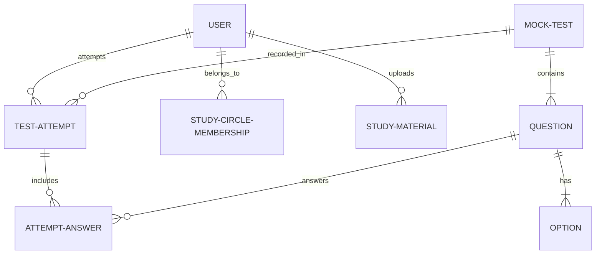
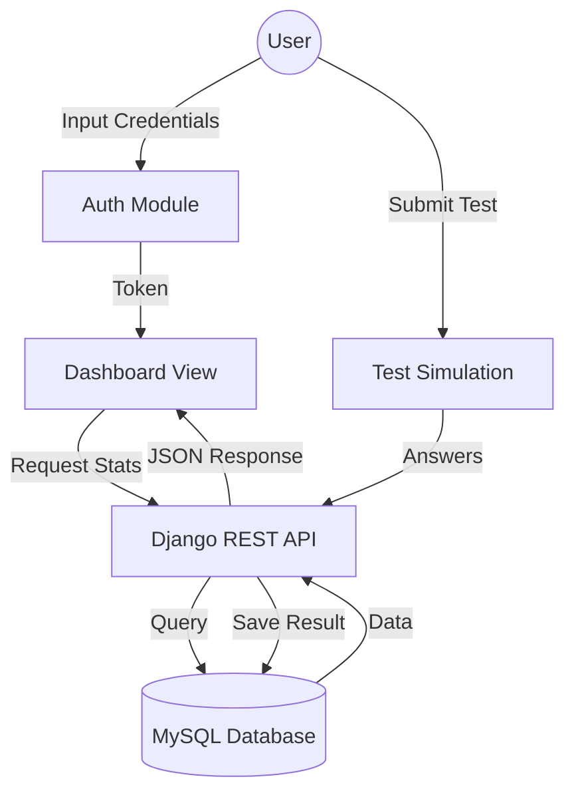

# EduFlow: Final Project Documentation

## 1. INTRODUCTION
EduFlow is an intelligent, production-ready study platform designed to revolutionize the learning experience for students and educators alike. Built with a focus on scalability, performance tracking, and collaboration, the platform bridges the gap between traditional study methods and modern digital learning. 

EduFlow provides students with a personalized dashboard that summarizes their learning journey, offers real-time analytics on their performance, and facilitates collaborative learning through "Study Circles." A core feature of the system is the "Mock Test Simulation," which provides a realistic environment for students to practice and improve their exam-taking skills with detailed feedback and performance history.

---

## 2. SYSTEM CONFIGURATION

### 2.1 HARDWARE CONFIGURATION
To ensure smooth development and deployment, the following minimum hardware specifications are recommended:
- **Processor**: Intel Core i5 / AMD Ryzen 5 or higher (Multi-core)
- **RAM**: 8 GB (16 GB recommended for concurrent backend/frontend dev)
- **Storage**: 256 GB SSD (Minimum 10GB free space for DB and assets)
- **Network**: Stable internet connection for package management and API synchronization.

### 2.2 SOFTWARE CONFIGURATION
- **Operating System**: Windows 10/11, macOS, or Linux.
- **Environment**: Node.js (v18.0+), Python (v3.10+).
- **Database**: MySQL 8.0 Server.
- **IDE**: Visual Studio Code with relevant extensions (ESLint, Python, Django).
- **Tools**: Git for version control, Postman for API testing.

### 2.3 USER REQUIREMENTS

#### 2.3.1 FRONT END SOFTWARE
- **Next.js 14**: Utilizing the App Router for efficient server-side rendering and routing.
- **TypeScript**: Ensuring type safety and robust code maintenance.
- **Tailwind CSS**: For a modern, responsive, and customizable design system.
- **Framer Motion**: Powering smooth transitions and interactive micro-animations.
- **Axios**: Handling asynchronous API requests to the Django backend.
- **Recharts**: Visualizing student performance data with interactive charts.

#### 2.3.2 BACK-END SOFTWARE
- **Django 6.0**: A high-level Python web framework for rapid development.
- **Django REST Framework (DRF)**: Building a robust and scalable RESTful API.
- **SimpleJWT**: Implementing secure JSON Web Token authentication.
- **MySQL**: A reliable relational database for structured data management.
- **Middleware**: Custom security and maintenance layers to ensure platform stability.

---

## 3. SYSTEM DEVELOPMENT ANALYSIS

### 3.1 OBJECTIVE OF THE SYSTEM
The primary objective of EduFlow is to provide a comprehensive ecosystem for student growth. Key goals include:
- Centralizing study resources and performance metrics.
- Automating mock test evaluation and analytics.
- Encouraging peer-to-peer learning through managed study circles.
- Providing administrators with tools for bulk data management (CSV uploads).

### 3.2 PROPOSED SYSTEM
The proposed system follows a **Decoupled Architecture**:
- **Independent Frontend**: A React-based single-page application (SPA) that communicates with the API.
- **Stateless Backend**: A Django REST API that handles logic, authentication, and data persistence.
- **Real-time Feedback**: Instant evaluation of mock tests and immediate updates to the dashboard.

### 3.3 FEASIBILITY STUDY

#### 3.3.1 TECHNICAL FEASIBILITY
The project utilizes the industry-standard "T3-like" stack (Next.js/TypeScript) on the frontend and "Django/MySQL" on the backend. These technologies have extensive documentation, community support, and proven scalability, making the system technically sound and maintainable.

#### 3.3.2 ECONOMICAL FEASIBILITY
The system is built primarily on open-source technologies, minimizing licensing costs. The decoupled nature allows for cost-effective deployment on cloud platforms (like AWS, Vercel, or Heroku) by scaling resources independently based on traffic.

#### 3.3.3 OPERATIONAL FEASIBILITY
The platform is designed with a high level of usability. Students can easily navigate their personalized dashboards, while administrators have a dedicated module to manage users and study materials with minimal technical overhead.

---

## 4. SYSTEM DESIGN

### 4.1 INTRODUCTION
EduFlow's design is modular, ensuring that features like `Mock Tests` and `Study Circles` can be updated or expanded without affecting the core `Accounts` system.

### 4.2 INPUT DESIGN
- **Authentication Forms**: Secured login and registration with validation for email and name.
- **CSV Data Import**: Bulk upload functionality for administrators to populate questions or users.
- **Test Submissions**: Real-time answer tracking during mock tests.

### 4.3 OUTPUT DESIGN
- **Student Dashboard**: Visual summaries of progress using Recharts.
- **Performance Reports**: Detailed breakdown of test results, including correct/incorrect counts and score calculations.
- **Notifications**: Real-time alerts for system updates or group activity.

### 4.4 DATABASE DESIGN
The system uses a relational schema in MySQL. Key models include:
- `CustomUser`: Extended user model with roles (Admin/User).
- `MockTest`: Container for test metadata (Title, Duration, Difficulty).
- `Question`: Specific items linked to tests, including subject and marks.
- `StudyMaterial`: File-based resources with metadata and download tracking.
- `TestAttempt`: Records of user performance on specific tests.

### 4.5 MODULE DESCRIPTION
- **Accounts**: Handles JWT-based authentication and user role management.
- **Mock Tests**: Manages test creation, question mapping, and evaluation logic.
- **Dashboard**: Aggregates data from other modules to provide a holistic user view.
- **Study Circles**: Manages group formation and collaborative learning spaces.
- **Admin Module**: Provides bulk upload tools and system-wide settings.

---

## 5. SYSTEM IMPLEMENTATION AND TESTING

### 5.1 SYSTEM IMPLEMENTATION
Implementation was conducted in phases:
1. **Core API**: Developing the user authentication and role management system.
2. **Dashboard Logic**: Implementing the aggregation logic for student stats.
3. **Frontend Integration**: Building the UI components and connecting them to the REST API.
4. **Advanced Features**: Adding Mock Test simulations and CSV upload tools.

### 5.2 SYSTEM TESTING
A multi-layered testing approach was adopted to ensure platform reliability.

#### 5.2.1 TYPES OF TESTING
- **Unit Testing**: Testing individual Django views and models (e.g., `python manage.py test`).
- **Integration Testing**: Verifying the communication between Next.js and the Django API.
- **Functional Testing**: Validating user flows like registration, test completion, and dashboard updates.
- **UI/UX Testing**: Ensuring responsive design across mobile and desktop devices.

---

## 6. CONCLUSION
EduFlow successfully integrates modern web technologies to create a powerful learning platform. By decoupling the frontend and backend, the system achieves high performance and modularity. The inclusion of detailed analytics and collaborative tools ensures that it is not just a study aid, but a comprehensive learning management ecosystem ready for production use.

---

## 7. APPENDICES

### 7.1 ER DIAGRAM


### 7.2 DATA FLOW DIAGRAM (DFD)


### 7.3 TABLES USED
| Table Name | Description | Key Fields |
| :--- | :--- | :--- |
| `accounts_customuser` | User registry | email, name, role, password |
| `admin_module_mocktest` | Test repository | title, exam_type, duration |
| `admin_module_question` | Questions pool | text, subject, correct_option |
| `mock_tests_testattempt` | Score history | user_id, test_id, score, date |
| `admin_module_studymaterial`| Resource links | title, file_path, subject |

### 7.4 SAMPLE CODE

**Backend: User Login View (Django REST Framework)**
```python
class LoginView(APIView):
    def post(self, request):
        serializer = LoginSerializer(data=request.data)
        if serializer.is_valid():
            email = serializer.validated_data['email']
            password = serializer.validated_data['password']
            user = authenticate(request, username=email, password=password)
            if user:
                refresh = RefreshToken.for_user(user)
                return Response({
                    "status": "success", 
                    "token": str(refresh.access_token),
                    "user": {"name": user.name, "role": user.role}
                })
        return Response({"status": "error", "message": "Invalid credentials"}, status=401)
```

---

## SAMPLE SCREENSHOTS

### Student Dashboard

*Figure 1: The primary student dashboard showing performance analytics and upcoming tests.*

### Mock Test Simulation

*Figure 2: The simulation environment providing a focused experience for test practice.*
